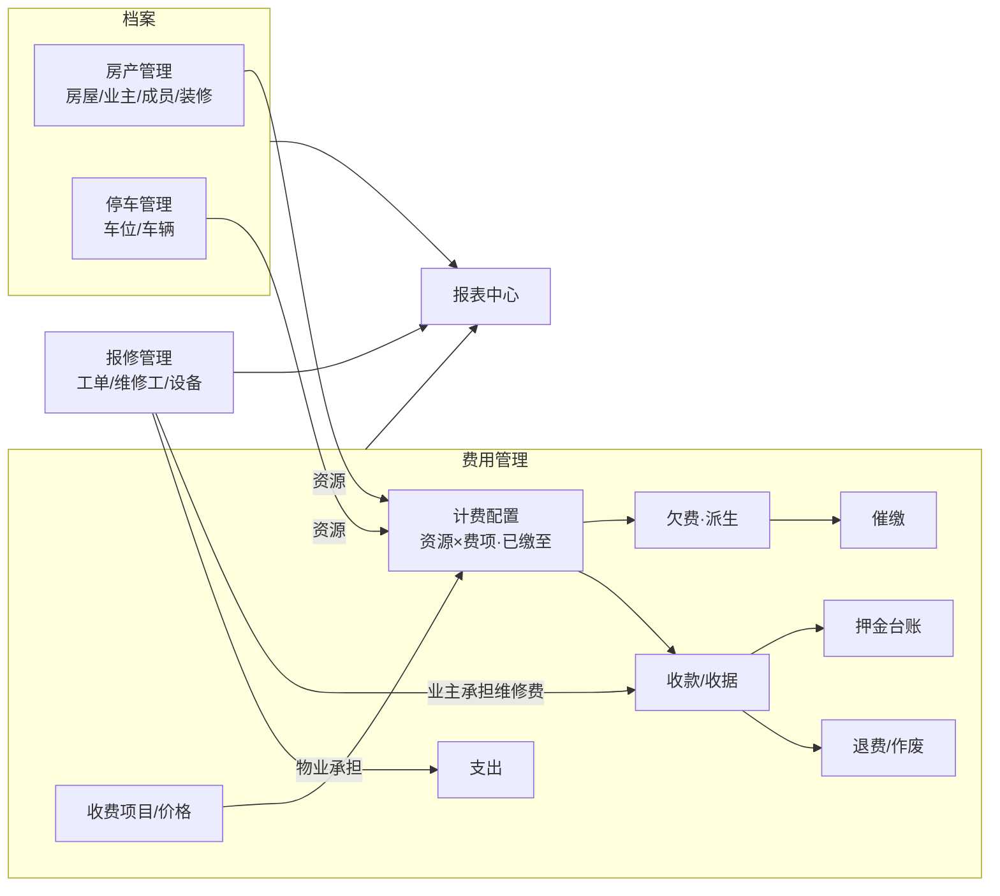
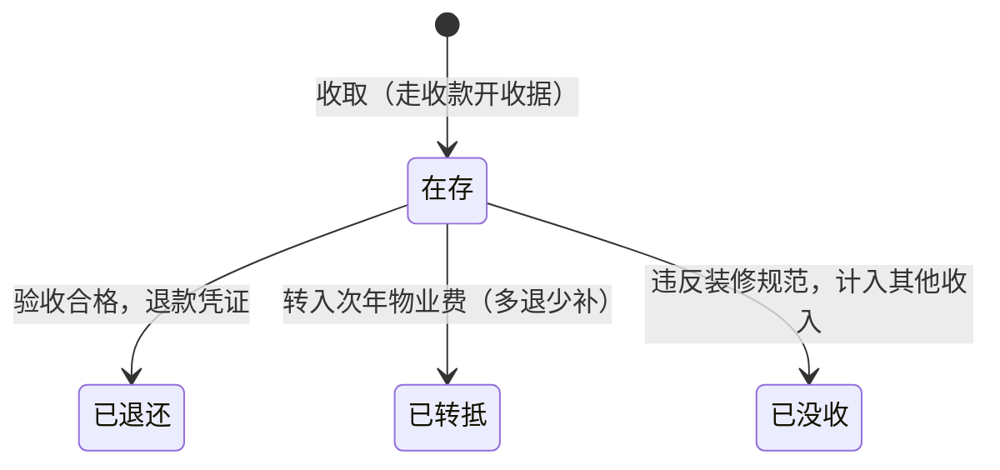
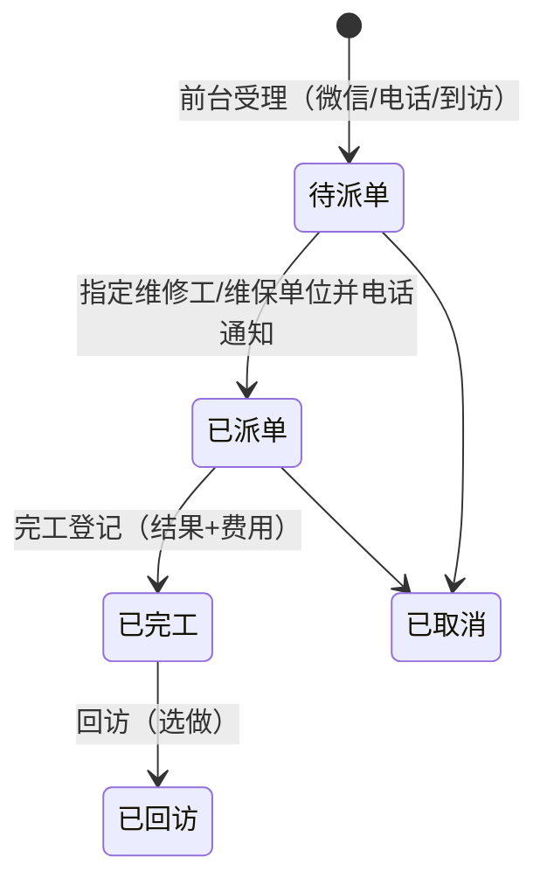
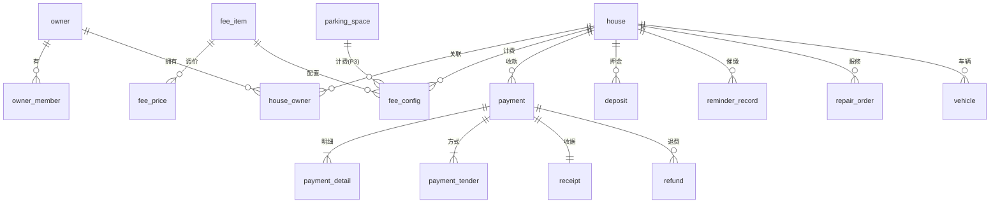

# Sphere 物业管理系统 — 业务与系统设计

服务对象：三都县强盛物业管理有限公司，管理小区：三都县粮食购销公司安置房。
本文档是开发前的完整业务设计，所有表结构、页面、规则以此为准；文末"待确认问题"逐条落实后冻结进入开发。

---

## 1. 现状与目标

### 1.1 现状（来自沟通与真实收款单据）

- 1 栋 1 单元，共 20 层，3 层及以上为住户，约 140+ 户；1–2 层性质待确认（见问题 A2）。
- 全纸质办公：业主到物业办公室缴费，手写/打印收款单据一式两份；无任何系统、无持久化台账。
- 真实收款单据（收据示例.docx）要素：
  - 抬头：`三都县强盛物业管理有限公司 · 收款单据`
  - `资源地址：三都县粮食购销公司安置房-住宅19-2`、`客户名称：杨琼燕`
  - 明细表列：序号 | 收费项目 | 单价 | 面积/用量 | 应收金额（元） | 实收金额（元） | 计费周期 | 月数 | 备注
  - 出现的收费项目：**物业费**（1.00 元/㎡/月 × 面积 119.43）、**装修垃圾清运费**、**装修保证金**（备注：若不违反装修规范，保证金转入下一年物业费，多退少补）
  - 合计：`实收合计（小写）：￥116元　大写：壹佰壹拾陆元整`
  - 尾部：收款人、收款方式（微信支付：￥116.00元）、客户签名、收款日期+时间
  - 一式两份上下两联，中间裁剪线；**无单据编号**（系统化后补上编号）
  - 优惠实例：应收 119.43 → 实收 116.00，备注"一次性提前交一年免一个月物业费"
- 报修：业主微信/电话联系物业，物业再联系水电工或电梯维保单位。
- 其他费用（水、电等）由其他公司收取，本系统不涉及代收代缴。

### 1.2 目标

| 阶段 | 内容 | 判定标准 |
|---|---|---|
| P1 | 房产/业主档案、物业费收缴、收据打印、欠费与催缴、押金、首页、核心报表、纸质数据导入 | 公司可以停用纸质单据，日常收费全走系统 |
| P2 | 报修工单、支出登记、车位车辆台账、装修登记、报表中心全量 | 覆盖全部日常业务 |
| P3 | 业主账号（小程序/H5 查询与通知）、短信/微信催缴、线上收费、车位收费启用 | 业主端自助 |

### 1.3 设计原则

1. **贴着线下动作做**：软件是登记与打印工具，不改变员工的工作方式；每个界面对应一个真实场景（业主站在柜台前、打印催缴单、接到报修电话）。
2. **少输入、多点选**：任何地方不出现内部 ID；房产靠搜索（房号/姓名/电话/拼音首字母）或楼层图点选。
3. **一切可打印、可导出**：收据、催缴单、退款凭证按真实纸样排版；台账报表全部可导出 Excel。
4. **先算清账**：金额计算规则（欠费、折扣、调价、押金转抵）在本文档写死，开发时不做二次发挥。
5. **一两个人也能用**：不设审批流；用角色权限区分"收费员能做的"与"仅管理员能做的"。

---

## 2. 角色与权限

小公司通常 2–5 人。预设两个角色，可在系统管理里增删（问题 D1 确认实际人员分工）。

| 操作 | 收费员 ROLE_CASHIER | 管理员 ROLE_ADMIN |
|---|---|---|
| 收费、开收据、补打收据 | ✓ | ✓ |
| 查看房产/业主/缴费/欠费 | ✓ | ✓ |
| 编辑业主联系方式、成员、车辆登记 | ✓ | ✓ |
| 登记催缴、打印催缴通知单 | ✓ | ✓ |
| 登记报修、派单、完工登记 | ✓ | ✓ |
| 新建/编辑房屋、面积修改 | — | ✓ |
| 收费项目与价格调整、计费配置 | — | ✓ |
| 作废收款、退费、押金退还/转抵/没收 | — | ✓ |
| 支出登记与编辑 | — | ✓ |
| 报表中心（收费类报表收费员可见） | 部分 | ✓ |
| 用户/角色/菜单、系统参数 | — | ✓ |

按钮级权限编码沿用已有的 `@RequirePerm` 机制，如 `fee:collect`、`fee:void`、`deposit:handle`、`expense:save`。

---

## 3. 总体模块图



---

## 4. 两个核心抽象

### 4.1 资源（收费对象）

收据上写的是"资源地址"，系统沿用这个概念：**资源 = 可被收费的对象**。

- 类型：住宅、商铺（如有）、车位、储藏室（如有）。P1 只有房屋类资源，车位在 P2 建台账、P3 视需要启用收费。
- 所有计费配置、收款、欠费都挂在（资源类型, 资源ID）上，显示名冗余存储（如 `住宅19-2`、`地面车位D-03`）。
- 好处：以后对车位收管理费/租金，收款、收据、欠费、催缴、报表全部复用，不改模型。原培训项目的表结构也是同样做法（付费对象类型 = 房屋/车位）。

打印时资源地址 = `{小区名称}-{资源显示名}`，小区名称取自系统参数。

### 4.2 已缴至（取代"月度批量生成账单"）

不预生成月度账单。每个（资源 × 周期性费项）维护两个日期：

- **计费起始月**：从哪个月开始要交这项费（通常为交房次月，见问题 A6）。
- **已缴至月**（paid_through）：已缴费期间的最后一个月，由收款明细聚合得出（缓存值，可随时重算）。

推导规则：

```
应缴区间 = [max(计费起始月, 已缴至月+1) .. 当前月]
欠费月数 = 应缴区间长度（≤0 则不欠费）
欠费金额 = Σ 区间内每月费额          （每月费额见 7.2，跨调价按月取价）
预缴月数 = 已缴至月 − 当前月         （>0 时为预缴）
```

这与他们口头说法一致（"你家物业费交到 2026 年 6 月了"），天然支持：每户缴费节奏不同、补缴任意月数、预缴一年、中途调价。**不允许跳月**：收款总是从最早未缴月起连续覆盖（先补旧欠再缴新费）。

---

## 5. 房产管理

### 5.1 房屋（house）

| 字段 | 说明 |
|---|---|
| floor / room_no | 层、房号（19、2） |
| full_name | 显示名 `住宅19-2`，**唯一键**；默认按 `{用途}{层}-{房号}` 生成，允许手改以兼容不规则房号 |
| usage | 用途：住宅 / 商铺 / 储物间 / 其他 |
| building_area | 建筑面积 ㎡，两位小数；物业费计费基数，改动仅管理员且留痕 |
| living_state | 自住 / 出租 / 空置 |
| delivered_date | 交房日期（决定计费起始的参考） |
| status / remark | 启用状态、备注 |

- 初始化：按 20 层批量生成房号骨架 → Excel 导入面积、业主、电话、已缴至（见 13 章）。
- 房屋详情页聚合展示：基本信息、业主与成员、车辆车位、各费项已缴至与欠费、缴费记录、押金、催缴记录、报修记录、装修记录（即上一版缺失的"每个房产的完整信息"）。

### 5.2 业主（owner）与成员（owner_member）

- owner：姓名、主电话、备用电话、证件号（选填）、备注。电话是催缴与报修的命脉，列表页可直接编辑。
- owner_member：所属业主、姓名、与业主关系（配偶/子女/父母/租客亲属/其他）、电话、备注。用途：实际来缴费/报修的常是家属，收款单据"客户名称"可从业主与成员中点选。

### 5.3 房屋—业主关系（house_owner）

- 字段：house_id、owner_id、关系（产权人/共有人/租户）、is_primary（收费联系人）。
- 一人多房（住宅+储物间）与一房多人（夫妻共有、租户）都支持。
- 租户：出租房的实际居住人，报修与日常联系找租户，催缴找产权人。

### 5.4 过户与变更（house_owner_change）

- 登记过户：原业主、新业主、日期、经办人、欠费处理说明。
- 规则：登记时系统提示该房未结清欠费与在存押金；**欠费随房保留**（小公司实际追缴习惯，向新业主主张前由公司自行协商），是否强制结清不由系统卡死。
- 押金：过户时提示处理在存装修保证金（退原业主或转移）。

### 5.5 装修登记（decoration_record，P2）

收据上的"装修垃圾清运费、装修保证金"说明存在装修管理动作：

- 字段：房屋、申请日期、预计起止、清运费收款单、保证金押金单、验收日期、验收结果（合格/违规说明）、经办人、备注。
- 流程：业主装修前来办公室 → 收清运费 + 保证金（走收费工作台，一张收据两行明细） → 装修完验收 → 押金退还 / 转抵次年物业费 / 没收（见 7.6）。
- P1 可以先只收钱（费项已支持），登记表 P2 补。

### 5.6 业主账号（owner_account，P3 预留）

- 手机号即账号，用于小程序/H5：查缴费记录与欠费、收电子催缴通知、后续线上缴费。
- P1 仅建表与业主档案关联，不做任何业主端界面。

---

## 6. 停车管理

现状：小区有车位但公司未管理、未收费。P2 先建台账把"有什么、谁在用"记清楚，收费能力在模型上预留（车位就是一种资源）。

### 6.1 车位（parking_space）

- 编号（如 `D-01`）、区域（地面/地下/车库，待确认 B1）、产权（业主自有/开发商/公共）、状态（空置/自用/出租/占用）、关联房屋（业主自有时）、备注。
- 显示名进入资源体系：`车位D-01`，未来启用"车位管理费/租金"费项即可收费开收据。

### 6.2 车辆（vehicle）

- 车牌、车主（业主或成员）、关联房屋、品牌颜色、常停位置、备注。
- 高频场景：**挪车**——有车挡路，前台按车牌查到业主电话。顶部全局搜索支持车牌。

### 6.3 使用关系（space_binding，启用收费时）

- 车位、使用人、方式（自有/租赁/月保）、起止。租赁/月保对应的收费走费用管理，零新增模型。
- 无道闸设备，不做临停计费；外来车辆只留备注性登记。

---

## 7. 费用管理（核心）

### 7.1 收费项目（fee_item）与调价（fee_price）

| 字段 | 说明 |
|---|---|
| name | 物业费 / 装修垃圾清运费 / 装修保证金 / 维修费 /（未来）车位管理费… |
| charge_mode | **周期-按面积**（元/㎡/月）、**周期-固定**（元/月）、**一次性**（金额可预设可手输） |
| item_kind | 费用 / **押金**（押金不算收入，见 7.6） |
| apply_to | 适用资源类型：住宅/商铺/车位/储物间（多选） |
| status / sort | 启用、排序 |

- fee_price：费项、单价、生效年月。**调价必须新增价格行**而不是改旧值，跨调价补欠费时按月取当月生效价，收据明细留痕当时单价。
- 预置数据：物业费（周期-按面积，1.00 元/㎡/月，待确认 A1）、装修垃圾清运费（一次性，标准待确认 A3）、装修保证金（押金，标准待确认 A3）、维修费（一次性手输，报修联动用）。

### 7.2 计费配置（fee_config）

（资源 × 周期性费项）一行：

- enabled、计费起始月、已缴至月（缓存）、单价覆盖（个别户协议价，空=用标准价）、备注（减免依据）。
- 每月费额 = （单价覆盖 ?? 当月生效标准价） × （按面积 ? 建筑面积 : 1）。
- 空置减免（若有，待确认 A4）：用"单价覆盖 + 备注"实现，简单直接；恢复时清掉覆盖价。
- 停用再启用：启用时必须重设计费起始月，停用期间不产生欠费（公式里 `max(计费起始, 已缴至+1)` 自然生效）。
- 批量操作：按楼层/用途批量启用某费项并设定计费起始（上线初始化用）。
- 一次性费项不需要配置行，收款时直接选。

### 7.3 收款流程（收费工作台）

场景：业主（或家属）到柜台。目标是 30 秒内完成一单。

1. **找到资源**：顶部大搜索框（房号/姓名/电话/车牌/拼音首字母），或楼层视图点选，或直接点欠费卡片。
2. **收款面板（右侧抽屉）**：
   - 头部：资源地址、主业主+电话、居住状态；客户名称默认主业主，可从业主/成员点选或手输（交钱的可能是家属）。
   - 周期费区：每个启用费项一行——已缴至、欠 X 月 ¥X；缴费月数默认**补清至本月**，快捷钮 `+6月` `+12月` `自定义至某月`；面板实时显示新"已缴至"。
   - 一次性费区：可添加行（装修垃圾清运费/装修保证金/维修费…），金额预设或手输。
   - 优惠：每行可填优惠金额 + 原因（下拉：年缴免一月 / 协商减免 / 抹零 / 其他+备注）。选 12 个月时提示"年缴免一月"快捷优惠（按当月单价×1 计算，开关见系统参数，待确认 A5）。
   - 合计：应收 / 优惠 / 实收，大写金额同步显示。
   - 收款方式：微信 / 现金 / 银行转账 / 押金转抵（组合支付见 7.6），默认微信（待确认 A7）。
3. **提交** → 生成收款单+明细+收据号，更新已缴至 → 自动弹出收据打印页（一式两份） → 打印后焦点回到搜索框（连续收费动线）。
4. 幂等：前端生成一次性提交键，后端唯一约束防重复入账。

### 7.4 收款单据（payment / payment_detail / payment_tender / receipt）

- payment：收款单号、资源、客户名称、应收/优惠/实收合计、收款人（登录人姓名）、收款时间、状态（正常/已作废）、备注、关联报修单（维修费时）。
- payment_detail：费项、期间起止（一次性费为空）、月数、**当时单价**、**当时面积**、应收、优惠、优惠原因、实收——收据可永久复现，与后续调价/面积修正无关。
- payment_tender：收款方式子表（方式, 金额），支持组合支付（例：押金转抵 ¥850 + 微信 ¥583.16）。
- receipt：与 payment 1:1，收据编号（连续流水，规则见 12.3）、打印次数、首打时间。补打允许，收据角标注"第 N 次打印"。
- **收据版式完全对照真实单据**：抬头、资源地址/客户名称、九列明细表、实收合计小写+大写、收款人/收款方式（多方式并列）/客户签名/收款日期时间，一式两份上下联+裁剪线，A4 纵向；新增右上角收据编号。

### 7.5 作废与退费

- **作废**（当日点错月数/金额的常见场景）：仅管理员；填原因；收据标记作废；台账保留不物理删除。
- **退费**（预缴后卖房等）：仅管理员；按费项从"已缴至"末尾整月往前退；金额默认 = 退还月数 × 当时实收单价（有优惠时按实收口径），可手改+原因；打印退款凭证（含客户签名栏）。
- **一致性规则（重要）**：同一（资源×费项）的作废与退费只允许作用于**期间最晚的一笔**（LIFO）。要动更早的收款，必须先处理其后的收款。这保证已缴期间永远连续无空洞，"已缴至"可安全重算：`已缴至 = 非作废收款明细的最大期间止月 − 已退月数`。

### 7.6 押金（deposit / deposit_event）

装修保证金专用生命周期，收支两条线都说得清：



- 收取：收费工作台加一行"装修保证金"，正常开收据；同时生成 deposit（房屋、金额、关联收款、状态=在存）。
- 转抵：发起"押金转抵缴费"→ 生成一笔新的物业费收款，payment_tender 含 `押金转抵 ¥X`，不足部分现金/微信补，超出部分退还——即收据备注里的"多退少补"；deposit 状态 → 已转抵，记录关联新收款。
- 退还：打印退款凭证，状态 → 已退还。
- 没收：仅管理员，填依据；报表中单列"押金没收收入"，不伪装成收款。
- 押金不计入收费收入报表（是负债），押金台账单独页展示在存总额。

### 7.7 欠费与催缴

- **欠费列表**：按 4.2 公式动态计算（140 户即时算，无需预生成）。列：资源、业主、电话、各费项欠费月数/金额、合计、最近缴费日期、最近催缴日期与结果。筛选：楼层、费项、欠费月数≥、金额≥、居住状态。合计栏常显。
- **催缴登记（reminder_record）**：房屋、方式（电话/微信/上门/纸质通知单/短信 P3）、联系对象+电话、内容摘要、结果（承诺 X 日前缴/无人接/拒缴/其他）、经办人、时间。房屋详情可见全部催缴史。
- **催缴通知单（批量打印）**：欠费列表勾选多户 → 每户一页 A4：公司抬头、房号与业主、截至年月的欠费明细表（费项/期间/月数/金额）+合计大写、`请于X月X日前到物业服务中心缴纳`、依据（物业服务合同约定）、公司落款+联系电话+日期。打印动作自动写入催缴登记（方式=纸质通知单）。
- 违约金/滞纳金：合同若有约定（待确认 A8），做成一次性费项手动收取，系统不自动累计。
- P3：短信/微信模板消息批量催缴，业主账号打通后电子送达。

### 7.8 支出管理（expense，P2）

- expense_category 可维护，预置：人员工资、公共水电费、电梯维保费、维修材料、清洁绿化、办公用品、税费、其他。
- expense：支出单号、日期、类别、金额、收款方、支付方式、摘要、票据号（选填）、关联报修单（选填）、经办人。票据照片附件 P2 视情况（问题 D3）。
- 报修完工登记"物业承担费用"时可一键生成支出记录草稿。
- 仅管理员操作；月度收支表联动（9 章）。

### 7.9 台账

收款、作废、退费、押金处理、催缴、调价、支出——全部留痕、可筛选、可导出。审计字段（create_by/time）沿用框架自动填充。

---

## 8. 报修管理

### 8.1 工单流程



- **受理**（30 秒录单）：选房号自动带出业主电话（可改为报修人）、类型（水电/管道疏通/电梯/公共设施/门禁/其他）、区域（户内/公共区域/电梯）、一句话描述、紧急标记（电梯困人置顶+红色）。
- **派单**：选维修工（档案见 8.2）或电梯维保单位，系统只做记录，实际通知靠电话。
- **完工登记**：完工时间、处理结果、材料费/人工费、**费用承担 = 业主 / 物业**：
  - 业主承担 → 跳转收费工作台按"维修费（一次性）"收款开收据，工单关联收款单；
  - 物业承担 → 一键生成支出草稿（类别=维修材料），管理员确认。
  - 费用承担的实际惯例待确认（问题 C1）。
- **回访**：结果（满意/一般/不满意）+备注，选做不强制。

### 8.2 维修工（repair_worker）

姓名、电话、工种（水电/电梯/综合）、类型（员工/外请）、状态。外请师傅也建档，派单时点选。

### 8.3 设备档案（equipment，轻量）

- 面向电梯为主（可放水泵/门禁）：名称（1号电梯）、类别、位置、**维保单位+电话**、上次维保日期、**年检有效期至**、备注。
- 首页提醒：年检 30 天内到期标黄、已过期标红。电梯类工单必选关联设备，形成单台设备的故障史（对付"这台电梯老坏"的争议）。

---

## 9. 报表中心（全部可导出 xlsx，EasyExcel）

| 报表 | 内容与口径 |
|---|---|
| 收款日报/期间明细 | 每笔收款明细；按收款方式小计（对现金、对微信账）；按收款人小计 |
| 月度收费汇总 | 按费项：当期实收（现金流口径 = 期间收款实收 − 退费，不含押金）；其中补欠/当期/预收三段拆分 |
| 收缴率报表 | 当月应收 = Σ启用配置的月费额；收缴率 = 当月费额中已被收款覆盖的部分 ÷ 当月应收；按费项、按月趋势 |
| 欠费明细表 | 每户各费项欠费月数/金额/合计 + 电话 + 最近催缴情况（催缴工作底稿） |
| 预收余额表 | 已缴至晚于当前月的户：预缴月数与金额（负债视角） |
| 押金台账 | 在存/已退/已转抵/已没收，期末在存余额 |
| 月度收支表 | 收入（按费项）− 支出（按类别）= 结余；押金没收收入单列 |
| 房产/业主台账、车位台账 | 档案全量导出 |
| 报修月报 | 单量按类型/区域、平均完成时长、费用合计（业主担/物业担） |

导出文件名：`报表名_起止期间.xlsx`；金额两位小数；表尾合计行。

---

## 10. 前端设计

### 10.1 菜单结构（即后端动态路由数据）

```
首页
收费工作台                ← 默认工作页
房产管理
  ├─ 楼宇视图
  ├─ 房产列表（含 Excel 导入）
  └─ 装修登记（P2）
业主管理
停车管理（P2）
  ├─ 车位台账
  └─ 车辆登记
财务管理
  ├─ 收款记录
  ├─ 押金台账
  ├─ 退费记录
  └─ 支出管理（P2）
欠费催缴
报修管理（P2）
  ├─ 报修工单
  ├─ 维修工
  └─ 设备档案
报表中心
收费设置
  ├─ 收费项目与价格
  ├─ 计费配置
  └─ 系统参数
系统管理
  ├─ 用户 / 角色 / 菜单
```

收费员默认可见：首页、收费工作台、房产、业主、停车、收款记录、欠费催缴、报修、报表（收费类）。

### 10.2 首页（针对公司定制）

- 顶部问候：`上午好，潘桂银` + 公司名 + 日期。
- 四个指标卡：**今日实收**、**本月实收**、**欠费户数/总额**（点击直达欠费列表）、**待处理报修**。
- 中部左：本年逐月收入柱状图（P2 加支出对比线）；中部右"待办"：待派单工单、电梯年检提醒、欠费≥3 个月 TOP 户。
- 底部：最近 10 笔收款。
- 常驻快捷钮：去收费、登记报修、打印催缴单。

### 10.3 收费工作台（最重要的一页）

- 顶部：大号搜索框（自动聚焦，支持房号/姓名/电话/拼音），右侧筛选（楼层、欠费月数、金额区间）与排序（欠费金额降序默认）。
- 主体：**欠费户卡片墙**。每卡：房号大字、业主+电话、欠费摘要（`物业费 欠8月 ¥955.44`）、颜色分级（≥6月红/1–5月黄）；点卡开收款抽屉。
- 非欠费户（预缴、装修收费）通过搜索进入同一抽屉。
- 收款抽屉按 7.3 流程；提交后直达打印页，打印完回工作台并刷新卡片。

### 10.4 房产 — 楼宇视图

- 20 行（层）× 每层房间格的栋楼平面：格内房号+状态色（欠费红/正常绿/空置灰/商铺蓝），悬停显示业主与欠费额；点格进房屋详情。
- 房屋详情页 tabs：基本信息 / 业主与成员 / 车辆车位 / 费用（各费项已缴至、欠费、缴费记录、押金）/ 催缴记录 / 报修记录 / 装修记录。柜台答疑一页看全。

### 10.5 其余页面要点

- **收款记录**：时间倒序表 + 状态/方式/收款人筛选；行操作：详情、补打收据、作废（管理员）、退费（管理员）。
- **押金台账**：状态卡片统计 + 列表；行操作：退还/转抵/没收（管理员，双确认）。
- **欠费催缴**：欠费列表（10.3 数据的表格形态，适合批量）+ 勾选批量打印催缴单 + 登记催缴；"催缴记录"子 tab。
- **支出管理**：置顶快捷登记表单（日期默认今天）+ 当月列表 + 类别维护入口。
- **报修工单**：三列看板（待派单/已派单/已完工）+ 列表切换；新建工单弹窗为接电话场景优化（房号联想、类型大按钮）；电梯困人红色置顶。
- **报表中心**：报表卡片 + 日期范围 + 表格预览 + 导出按钮。
- **收费设置**：费项表 + 调价弹窗（生效年月，历史价格只读）；计费配置支持按楼层/用途批量启停与设置起始月；系统参数表单。
- **Excel 导入**：模板下载 → 上传 → 校验预览（错误行标红：房号重复、面积非法、已缴至格式错）→ 确认导入 → 结果报告。

### 10.6 打印

- 独立打印路由 + 打印专用 CSS（A4，隐藏系统外壳），页面按真实单据逐毫米对版。
- 三种单据：收款单据（一式两份+裁线）、催缴通知单（一户一页可连续多页）、退款凭证（含签名栏）。
- 普通 A4 打印机即可（打印机型号待确认 A9）。

### 10.7 操作性原则（上一版教训的固化）

1. 任何输入框都不要求用户知道内部 ID；一切走搜索与点选。
2. 高频操作两步内完成：搜索→收款；点卡→收款。
3. 智能默认：缴费默认补清至本月、日期默认今天、客户默认主业主、方式默认上次使用。
4. 不可逆操作（作废/退费/没收/删除）二次确认并要求填原因；其余不打扰。
5. 错误提示说人话（"该房号已存在：住宅19-2"，而不是唯一键冲突）。
6. 金额输入即时显示大写与合计；打印后自动回到下一单动线。

---

## 11. 数据模型清单

命名：全小写下划线；金额 `decimal(10,2)`；年月统一 `char(7)` 形如 `2026-01`；审计字段（create_by/create_time/update_by/update_time/deleted）与逻辑删除沿用 BaseEntity。

### 11.1 档案域

| 表 | 关键字段 | 约束 |
|---|---|---|
| house | floor, room_no, full_name, usage, building_area, living_state, delivered_date, remark | uk(full_name) |
| owner | name, phone, phone2, id_card, remark | idx(phone) |
| owner_member | owner_id, name, relation, phone | |
| house_owner | house_id, owner_id, relation(产权人/共有人/租户), is_primary | uk(house_id, owner_id) |
| house_owner_change | house_id, old_owner_id, new_owner_id, change_date, note, operator | |
| decoration_record | house_id, apply_date, plan_from/to, fee_payment_id, deposit_id, accept_date, accept_result, note | P2 |
| owner_account | owner_id, phone, password, status | P3 |
| parking_space | code, zone, ownership, state, house_id, remark | uk(code)，P2 |
| vehicle | plate_no, owner_id, house_id, brand_color, usual_space, remark | uk(plate_no)，P2 |
| space_binding | space_id, owner_id, mode(自有/租赁/月保), start_date, end_date | 启用收费时 |

### 11.2 费用域

| 表 | 关键字段 | 约束 |
|---|---|---|
| fee_item | name, charge_mode(AREA/FIXED/ONCE), item_kind(FEE/DEPOSIT), apply_to, status, sort | uk(name) |
| fee_price | fee_item_id, price, effective_month | uk(fee_item_id, effective_month) |
| fee_config | resource_type, resource_id, fee_item_id, enabled, start_month, paid_through(缓存), price_override, remark | uk(resource, fee_item_id) |
| payment | pay_no, resource_type/id, resource_name, customer_name, total_receivable/discount/received, cashier_name, paid_at, status(正常/作废), void_reason, repair_order_id, remark | uk(pay_no), uk(client_token 幂等) |
| payment_detail | payment_id, fee_item_id, period_from, period_to, months, unit_price, area, receivable, discount, discount_reason, received | |
| payment_tender | payment_id, method(微信/现金/转账/押金转抵), amount | |
| receipt | payment_id, receipt_no, print_count, first_print_at | uk(receipt_no) |
| refund | refund_no, payment_id, fee_item_id, months, period_from/to, amount, reason, method, operator, refund_at | |
| deposit | house_id, fee_item_id, amount, payment_id, status(在存/退还/转抵/没收), handled_at, handle_note, rel_payment_id(转抵), rel_refund_no(退还) | |
| reminder_record | house_id, channel, contact_name, contact_phone, summary, result, promised_date, operator, remind_at | |
| expense_category | name, sort | P2 |
| expense | expense_no, expense_date, category_id, amount, payee, method, summary, invoice_no, repair_order_id | P2 |

### 11.3 报修域（P2）与系统域

| 表 | 关键字段 |
|---|---|
| repair_order | order_no, source, house_id, contact_name/phone, type, area(户内/公共/电梯), equipment_id, urgent, description, status, worker_id, dispatch_at, complete_at, solution, material_cost, labor_cost, cost_bearer(业主/物业), payment_id, expense_id, visit_result, visit_note |
| repair_worker | name, phone, trade, kind(员工/外请), status |
| equipment | name, category, location, maintainer, maintainer_phone, last_maintain_date, inspection_expire_date, remark |
| sys_param | key, value, remark（公司全称、小区名称、联系电话、收据条款、年缴免一月开关、欠费宽限月数、各单据编号前缀与当前序号） |
| sys_user/role/menu… | 已有 |

### 11.4 ER 概览



---

## 12. 关键规则与一致性

### 12.1 金额与期间

- 最小计费单位为自然月，不做按天分摊；月数为正整数。
- 每月费额 = 单价（该月生效价，或该户覆盖价）×（按面积 ? 面积 : 1），逐月计算后求和（正确处理跨调价）。
- 金额保留两位小数；大写金额用标准人民币大写转换（壹贰叁…整/角/分）。
- 优惠只能使实收 ≤ 应收，且必须带原因。

### 12.2 已缴至的重算

`已缴至 = 该（资源×费项）非作废收款明细的最大 period_to − 已退月数`。作废/退费遵循 LIFO 规则（7.5），期间永远连续；每次作废/退费后同步重算缓存并写台账。

### 12.3 单据编号

| 单据 | 规则示例 |
|---|---|
| 收款单号 | SK20260111-003（日期+当日序） |
| 收据编号 | 2026-00012（年+5 位流水，连续不跳号；作废占号并标注） |
| 退款单号 | TK20260111-001 |
| 支出单号 | ZC202601-015 |
| 工单号 | BX20260111-002 |

前缀与起始序号在系统参数配置；编号生成用数据库行锁保证并发唯一。

### 12.4 幂等与并发

- 收款提交携带客户端一次性 token，payment 表唯一约束兜底，重复提交返回原单。
- 同一资源同一费项并发收款：以（资源、费项、period_from）唯一性拦截重叠期间。

### 12.5 数据修正的边界

- 面积修改：仅管理员，留痕；不追溯已出收据（明细存了当时面积），只影响此后计费。
- 已导出报表后作废跨月单据：系统允许但在作废弹窗提示"该单属于 X 月，相关月报需重新导出"。

---

## 13. 数据初始化与上线

1. **建骨架**：管理员录入楼层结构，批量生成 20 层房号（用途默认住宅，1–2 层按确认结果设置）。
2. **Excel 导入**：模板列——层, 房号, 面积, 用途, 居住状态, 业主姓名, 电话, 备用电话, 成员(可空), 物业费计费起始月, 物业费已缴至月, 备注。公司对着纸质登记本整理（能否整理出待确认 A6）。
3. **核对**：导入后打印《底数核对表》（每户面积/业主/已缴至/当前欠费额）交公司逐户勾对，改完再冻结。
4. **双轨一周**：纸质照开，系统同录，比对日报一致后停纸质。
5. **部署**：用户已有服务器；单机部署 MySQL + Redis + Nacos + 3 个 jar + Nginx（托管前端静态与 /api 反代）。
6. **备份**：每日凌晨 mysqldump 到本地目录保留 30 天 + 每周异地（下载到公司电脑）一次；这是纸改电后的生命线。

---

## 14. 开发分期

| 阶段 | 范围 | 出口标准 |
|---|---|---|
| P1 | 房产/业主/成员档案、Excel 导入、费项与调价、计费配置、收费工作台、收据打印、作废、押金（收/退/转抵/没收）、欠费列表、催缴登记与通知单打印、首页（简版）、收款日报/欠费明细/预收余额导出、系统参数 | 公司柜台完全用系统收费开票 |
| P2 | 退费、支出、报修全流程、设备档案、车位车辆台账、装修登记、楼宇视图完善、报表中心全量、首页收支图 | 覆盖全部日常业务 |
| P3 | 业主账号、短信/微信催缴通知、线上收费（聚合支付）、车位收费启用 | 业主自助 |

---

## 15. 待确认问题

### A. 收费（P1 开发前必须确认）

1. 物业费单价确认为 1.00 元/㎡/月？全楼统一价还是分户型/楼层有差异？
2. 1–2 层是什么（商铺/车库/架空层/办公）？若是商铺：物业费单价多少、由谁交？
3. 装修垃圾清运费的收费标准（固定一笔多少钱？按面积？）；装修保证金的金额标准？没收的判定谁说了算，历史上发生过吗？
4. 空置房有没有减免惯例（如按 70% 收或免收）？现在空置大概几户？
5. "一次性提前交一年免一个月"是长期政策还是活动？还有其他优惠口径吗？
6. 纸质登记本能否整理出每户"面积 / 业主 / 电话 / 物业费已缴至哪个月"？（决定初始化方式）新交房从当月还是次月起算？
7. 收款方式实际有哪些？微信是老板个人码还是对公？需要按方式分开对账吗？
8. 合同里有滞纳金/违约金条款吗？实际收过吗？
9. 打印机是普通 A4 激光/喷墨吗？（决定收据版式是否要适配针式打印纸）

### B. 房产与车位

10. 车位情况：地面/地下各多少个？有业主买断产权的吗？有储藏室这类要收费的附属资源吗？
11. 公司有没有计划开始收停车费/车位租金？大概什么标准？
12. "按车牌找业主电话"（挪车）这个功能需要吗？

### C. 报修

13. 户内维修的材料费/人工费：物业代收开收据，还是师傅直接跟业主结？维修工是自家员工还是外面请？
14. 电梯几部？维保单位名称电话？要不要年检到期提醒？

### D. 其他

15. 员工几个人、怎么分工？（决定开几个账号、两种角色够不够）
16. 除这栋楼外公司还管别的项目吗？（决定要不要在模型里留"多楼栋"字段）
17. 支出记录需要拍票据照片存档吗？
